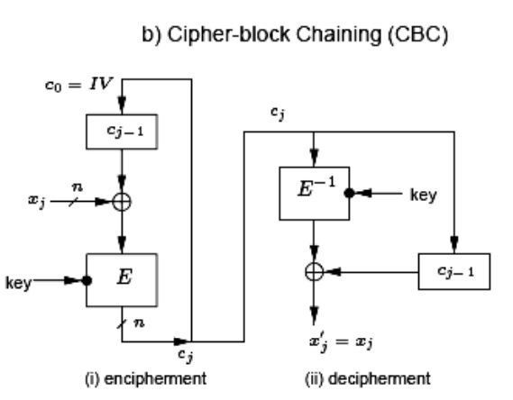

# cifrador-simetrico-de-bloco

## To-do:

- [ ] O algoritmo de key scheduling (geração de subchaves)
- [ ] O algoritmo de ciframento e deciframento
- [ ] O algoritmo de modo de operação CBC

---
# Descrição do trabalho 

Elaborar um cifrador simétrico de bloco (para blocos de 48 bits) , que permita criptografar e decriptografar um
arquivo (de qualquer tamanho) utilizando uma chave de 32 bits (o valor da chave é inicialmente fornecido pelo usuário
como valor de entrada do processo de key scheduling). Implementar também a camada do modo de operação, que deve ser o
modo CBC.

Desta forma, três processos criptográficos devem ser implementados:

- O algoritmo de key scheduling (geração de subchaves)
    - planejar quantas subchaves, tamanhos das subchaves, etc
- O algoritmo de ciframento e deciframento
    - planejar quantidade de rounds, como serão as operações de substituição (via S-Box, por exemplo) e de
      transposição (via permutações, shifts circulares, etc)
- O algoritmo de modo de operação CBC

O algoritmo deve procurar maximizar as propriedades de confusão e difusão. Isto pode ser alcançado através do uso de
operações de substituição e transposição, respectivamente. A forma como estas operações irão ser implementadas, bem como
a arquitetura/estrutura dos algoritmos criptográficos a serem desenvolvidos são de livre escolha/criação. Uma idéia que
norteia a construção de cifradores simétricos é que a estrutura dos algoritmos costuma ser a mesma tanto para cifrar
quanto para decifrar.

Então, resumindo:

O usuário cria uma chave de 4 bytes (32 bits) e fornece um arquivo por ele selecionado, que deve ser então lido e
cifrado pela aplicação em blocos de 48 bits (6 bytes), gerando um arquivo com blocos cifrados. Neste processo de
ciframento deve ter sido utilizado também a camada de modo de operação CBC. O tamanho do arquivo resultante (i.e., do
arquivo cifrado) deve ser similar ao do arquivo original, excetuada a necessidade de armazenamento no arquivo cifrado de
metadados (em um cabeçalho, por ex.). Outra observação é quanto a necessidade do uso de padding, uma vez que o tamanho
do arquivo original pode não ser múltiplo de 6 bytes (a operação de padding é eventualmente necessária no último bloco a
ser cifrado, e envolve a adição de bits extras de forma a completar um bloco de 48 bits para possibilitar seu
ciframento). No deciframento, a informação gerada pelo padding deve ser descartada.

Além da postagem das implementações, deve ser postado também um documento que apresenta a definição dos algoritmos
desenvolvidos para o key scheduling e para o ciframento/deciframento. Neste documento deve ficar claro quais estratégias
foram empregadas para maximizar tanto a propriedade de confusão quanto a propriedade de difusão.

Obs.: não devem ser utilizadas bibliotecas/módulos/componentes que implementem CBC/outros algoritmos criptográficos. A
única exceção se aplica a bibliotecas / módulos / componentes que facilitem operações bitwise.

---

# Help

## CBC

